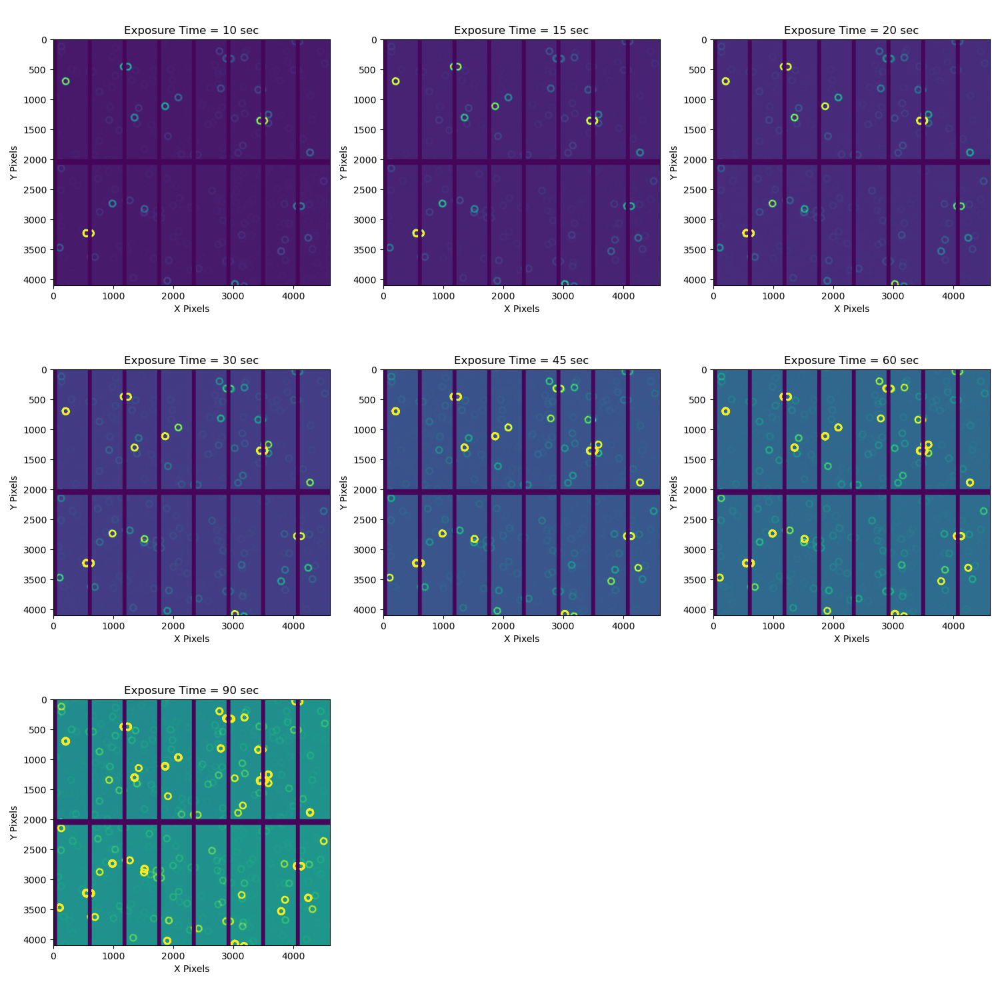
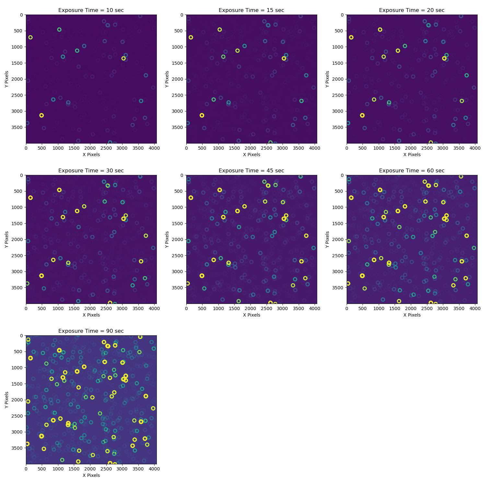
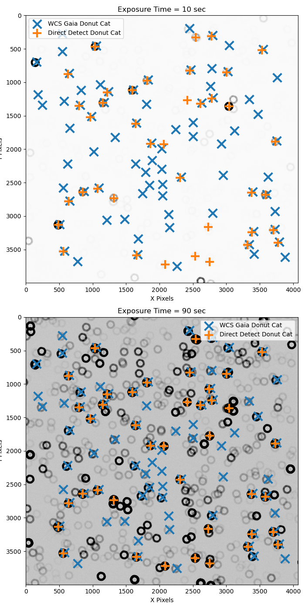
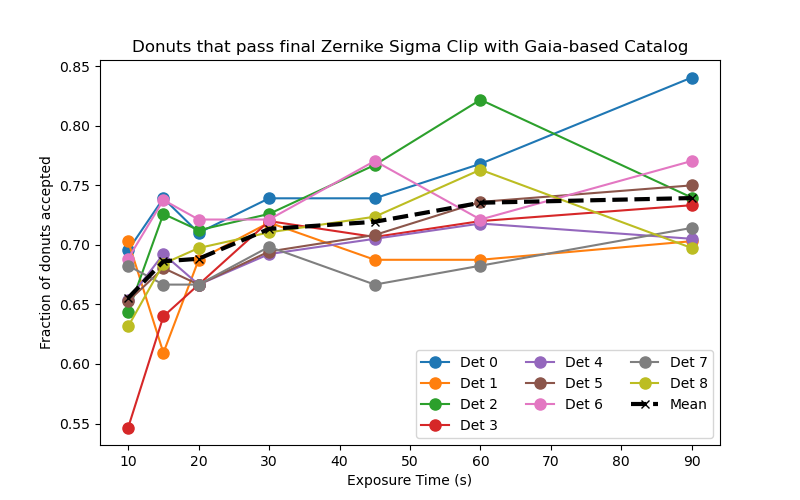
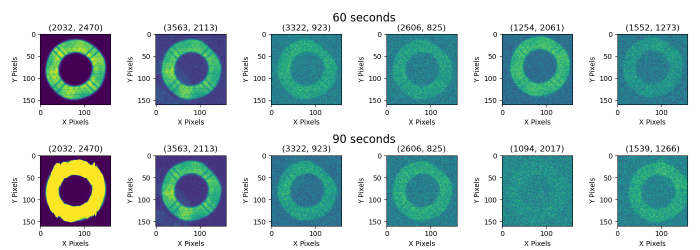

# WEP performance as a function of exposure time

```{abstract}
In this technote we evaluate the performance of the Active Optics System Wavefront Estimation Pipeline on a series of defocal exposures taken with different exposure times. This is acheived by comparing the estimated optical state from the pipeline to a known injected optical state. We will also evaluate the performance of the "direct detection" pipeline used in the AOS when pointing information is not accurate enough to use the reference catalogs as we expect during the initial days of commissioning.
```

## Introduction

This technote will explore how the Active Optics System (AOS) Wavefront Estimation Pipeline (WEP) behaves as a function of exposure time. The WEP algorithms attempt to quantify the optical state of the telescope by looking at postage stamps of defocused stars. Looking at exposures with increasingly longer exposure times allows us to study the performance of the WEP estimation as we move from faint images where only the brightest stars are visible to longer exposures where saturation might become a problem or crowding can lead to issues from blending. These issues are problems at all times but with good pointing information and accurate reference catalogs we can carefully choose sources at the catalog generation step that are not too bright and are far enough away from other sources that may overlap. However, at the beginning of commissioning we will need to use a "direct detection" algorithm where we choose sources for the WEP with image detection algorithms. This dataset also provides a good testing ground for this technique as we expect it to become more difficult with more crowded fields and increasing the exposure time creates this effect on the same field for comparison.

Therefore we will present results for two main studies in this technote:

1. Understand the performance of the WEP estimation algorithms at different exposure times and identify any problems that arise when looking at very faint or very bright images.
2. Use the different exposure times of the same field to analyze the performance of direct detect catalog generation for the WEP in sparsely populated low-SNR fields as well as crowded fields with more blended sources.

## Simulation

We created a set of simulated ComCom images using [imSim](https://www.github.com/LSSTDESC/imsim) and the Gaia DR2 catalogs on USDF accessed through the [SkyCatalogs](https://github.com/LSSTDESC/skyCatalogs) interface with imSim. The initial optical state was the same as state #1 in the 100 optical states simulated for [WET-001](https://sitcomtn-104.lsst.io/). Using this inital optical state we generated a triplet of intra-focal, in-focus, and extra-focal images for a set of 7 different exposure times in the r-band: 10, 15, 20, 30, 45, 60, and 90 seconds.

| SeqNum | Exposure Time |
|--------|---------------|
| 1-3    | 10 sec        |
| 4-6    | 15 sec        |
| 7-9    | 20 sec        |
| 10-12  | 30 sec        |
| 13-15  | 45 sec        |
| 16-18  | 60 sec        |
| 19-21  | 90 sec        |

The field we chose was centered at (RA, Dec) = (14:06:22.298, -26:40:56.5017) at MJD = 60518.00189 (07/27/2024). The images have been ingested into the AOS butler found on the USDF at: `/sdf/group/rubin/repo/aos_imsim/`. In Figure 1 we show the raw images for detector 4 across the 7 different exposure times.


<figure>
  
  <figcaption>Figure 1: Raw simulated extra-focal images for detector 4 on LSST ComCam across 7 different exposure times.</figcaption>
</figure>

## Data processing

After ingesting the raw images we ran Instrument Signature Removal (ISR) on the data and saved them to the collection `WET-013` in the AOS butler. This way we have a shared set of post-ISR images we can use for processing in different ways. Figure 2 shows what the same exposures as the raws in Figure 1 look like after ISR.

<figure>
  
  <figcaption>Figure 2: Simulated extra-focal images for detector 4 on LSST ComCam after Instrument Signature Removal.</figcaption>
</figure>

Now we were ready to run the WEP in two different ways: 1) Using the available Gaia DR2 reference catalog that was used to generate the simulations and is available in the butler. We use the exposure's WCS to translate (ra, dec) to pixel coordinates and identify single, unblended donuts based upon these reference catalogs with no reference to the pixel level data. 2) Using our "direct detection" algorithm that runs a convolution of a donut model across the image and identifies donuts as peaks in the convolved image. This works without any reference to the image's WCS and is something we expect to use early in commissioning as the pointing model will likely not be good enough to use the reference catalog method right away.

## Comparing Catalog Generation

Since the Gaia catalog does not have LSST magnitudes we currently run the Gaia catalog without magnitude limits but do use the donut source selection algorithms in WEP to discard blended objects and only select isolated donuts. Note that since we are using a catalog with Gaia "phot_g_mean" magnitudes that the two magnitude difference between a source and any dimmer, overlapping sources that we use to determine a blend or not is calculated in "phot_g" mags and not in LSST magnitudes. For more information on the source selection algorithms used by WEP see [SITCOMTN-130](https://sitcomtn-130.lsst.io/).

To make a fair comparison of the catalog contents we also run the direct detection algorithm without discarding any donuts solely on magnitude. The Gaia results can be found in the butler collection `WET-013/wcsGaiaCatalog` and the direct detect results can be found in `WET-013/directDetectCatalog_NoMagLimit`. We also ran the direct detect catalog with no custom settings (i.e., with the default magnitude selection steps included) and stored the results in the `WET-013/directDetectCatalog` collection. The LSST Science Pipeline configuration files are stored in the `notebooks/scripts` folder that accompanies the source code of this technote on github.

In Figure 3 we show the comparison between the two catalogs in the 10 second and 90 second exposures of detector 4. The Gaia catalog has the same sources in each image and the difference between detected sources in 10 and 90 seconds using direct detection is small as we will show more conclusively later in this section but first we will analyze the results of the Gaia-based donut catalog.

<figure>
  
  <figcaption>Figure 3: Comparison of sources detected in 10 second and 90 second exposures with direct detection and the Gaia-based catalog.</figcaption>
</figure>

### Gaia-based Catalog

When looking at the 90 second exposure and the Gaia catalog we see that even with the very long exposure time we have sources in the Gaia catalog that are still faint or do not actually appear in the image. We expect that there will be catalog sources in real data that will not appear where or how we expect for a variety of reasons and we handle these donuts in the steps where we calculate Zernikes. At that point in the pipeline donuts with postage stamps that are empty or very faint will give estimated Zernike coefficients that are outliers when compared to the others. We algorithmically remove the outlier Zernikes and only calculate the mean Zernike coefficients for each detector on a sigma clipped set of Zernike coefficients.

We also have a signal-to-noise ratio (SNR) filter that is currently in development and we will have it as part of the default pipeline by the time ComCam commissioning starts this fall. The SNR filter will calculate a SNR value for donuts when cutting out postage stamps of donut sources and record this information. Stamps that fall below the SNR threshold will not even be included in the calculation step.

As part of the metadata stored in the butler repository during the calculate Zernikes step of the pipeline we include the information on which donuts sigma clipping removed from the final estimate. In figure 4 we show the fraction of donut sources that passed the sigma clipping step in the final Zernike calculation as a function of exposure time. Since the Gaia-based catalog will be the same for all exposure times we are essentially measuring the number of quality Zernike estimates we get as a function of exposure time. While there is a lot of noise at shorter exposure times across the detectors there is a trend in the mean that shows we get more quality Zernike estimates at longer exposure times. This is expected as SNR will affect the quality of the Zernike estimate. However, we notice that between 60 seconds and 90 seconds we see that for detectors 2 and 8 have a lower number of accepted donuts as we go to the higher exposure time. 

<figure>
  
  <figcaption>Figure 4: Donut sources from Gaia-based catalog that pass sigma clip filtering in Zernike calculation step as a function of exposure time.</figcaption>
</figure>

In figure 5 we see the intra-focal donut stamps for detector 2 between 60 seconds and 90 seconds as well as the (x,y) centroid positions in pixels of the sources in the donut stamp. Here we can identify four possible reasons for rejection of the donut stamps: 1) Saturation: The source in the first column from left to right becomes saturated and distorted when going from 60 to 90 seconds. This donut is the brightest donut from the reference catalog on this detector so this makes sense. 2) Faint Blends: The source in the second column does have a faint blend overlapping the central source. While in the catalog we use a two magnitude cut to define a blended source the studies affirming the effectiveness of this cut were conducted with LSST bands not the Gaia bands used by the existing Gaia DR2 based reference catalog without equivalent LSST bands. Furthermore, they were conducted on exposure times of 30 seconds and it may just be that as blends become brighter due to longer exposure tiems they have a greater tendency to affect the Zernike estimates. 3) Faint Sources: The sources in the third and fourth columns simply look to be low SNR sources that perhaps were able to pass in the 60 seconds but not 90 seconds merely through random noise in the 90 second image making the estimate worse. 4) Recentering Failures: The WEP code recenters sources before saving the final postage stamps through a convolution of a donut model identifying the center of the source with a peak finding algorithm. We do this to correct for any shifts of a few pixels due to the WCS translation between catalog coordinates and pixel values. However, if a source identified in the reference catalog is not present in the image or there is a low SNR the peak finder can center on hot pixels or sources that come into the edge of the postage stamp and create large recenters greater than 5-10 pixles that we would anticipate being the maximum shift needed for a source that is present in the image. As a result, we will add a max recentering configuration to the WEP code before commissioning.

<figure>
  
  <figcaption>Figure 5: Intra-focal donut postage stamps for detector 2 that are used in the final Zernike calculation at 60 seconds exposure time (top row) but not at 90 seconds (bottom row).</figcaption>
</figure>


### Direct Detection Catalogs at different exposure times


## Zernike Estimation Results
